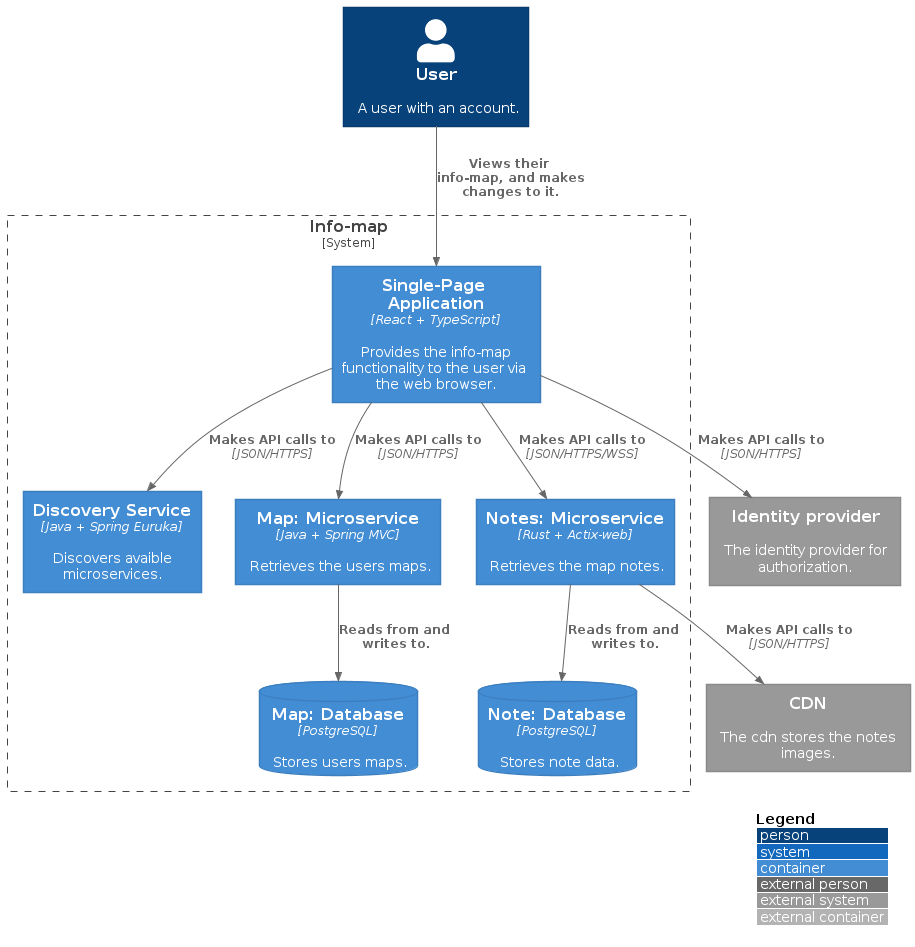

# Info-map

<!-- ## The concept
An “infinite“ map focused on mainly storing notes that could come in handy some day. These notes can be linked together to create a structure of similar information. By using a map there is no need for opening any other windows which cuts down on clicking around and losing track of other relevant information. The idea came from always learning new things and wanting to keep track of that information in a way that’s very accessible. -->

